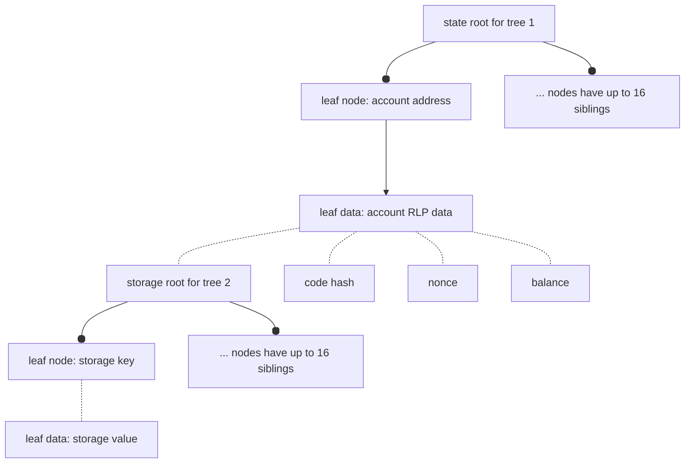
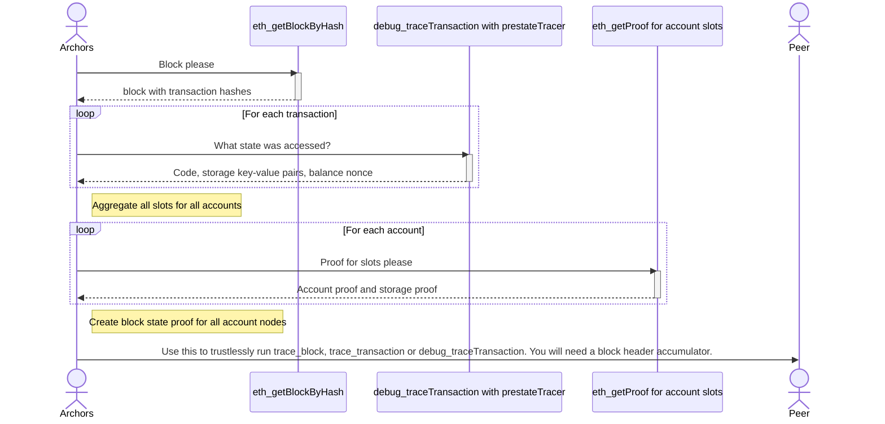

# archors

**arch**ival sciss**ors**: A tool for single Ethereum archival block state proofs.

## Why

To send a single historical block (as an historical state proof) to a peer and have
them be able to trustlessly trace the transactions in that block.

Background: https://perama-v.github.io/ethereum/protocol/archive

Who would want that? If there was a network distributing such proofs then users could
collectively shard an archive node. This could be an extension to an existing network
such as the Portal Network, which already has a block header cryptographic accumulator.

## Status

> Toy/experimental

In order to construct proofs for the entire history of the chain an Ethereum execution
node must provide both:
- debug_traceTransaction
- eth_getProof

## Modes

### Generate

Start with a block trace, generate a Merkle proof of any state accessed by that block.

### Consume

Start with a block state proof, generate a trace of that block.

## Use case

Run `debug_traceTransaction` or `trace_Transaction` with minimal data. A CDN could provide
proofs for all historical blocks. Acquisition of one is sufficient to trustlessly replay
that block and trace a single transaction.

## Requirements

- Requires knowledge of canonicality of block headers, such as through a cryptographic accumulator.
- Full node connection for blocks up to 128 blocks old, or archive node connection for older blocks.

## State proof viz

We are working with radix trees. The radix trees have depth 2, which makes them
a Practical Algorithm to Retrieve Information Coded in Alphanumeric (PATRICIA) trees.

The trees are nested, with one state tree (tree 1) holding the roots of many storage trees (tree 2).

### State tree value structure
The leaf data of the state root (first) tree is Recursive Length Prefix (RLP) encoded.
So to provide someone with a specific storage value (e.g., some storage slot that will be
accessed during a block) in the storage (second) tree, the RLP data must be reconstructed, hashed and proved in the first
tree. This requires that the code hash, nonce and balance for every account accessed must be
part of the proof data.

### Combining all accessed state

A retrospective look at one block can reveal all the leaf data that is needed to execute that block.
Aggregation of all those values into one big tree (tree 1 containing many values including
tree 2 roots) is the proof.

Imagine that a block only accessed one storage value from one contract (AKA account).
Here is the data that would be in the proof:
- Storage key
- Storage value
- Account storage root (of storage tree, using key/value)
- Account code hash
- Account nonce
- Account balance

A call to `debug_traceTransaction` with the `prestateTracer` may return
balance, code, nonce and storage, and some fields may absent.

If only the balance of an address is accessed (there is code etc that is not
accessed), the other fields are still required. Once obtained, the other fields are RLP encoded
to get the account leaf, then the hash of that encoded data is the account node.

Thus the prestateTracer is necessary (to know which storage keys are accessed) but
insufficient (does not get account storage root or other unaccessed account state fields).

The next step is therefore to call `eth_getProof` for every account. This will
provide the account node (account state root), the account value (RLP encoded data)
and the storage proof against the storage root in that encoded data.

The proof sent to a peer is a proof of all accessed accounts, and for each account
a proof for each accessed storage slot is included.