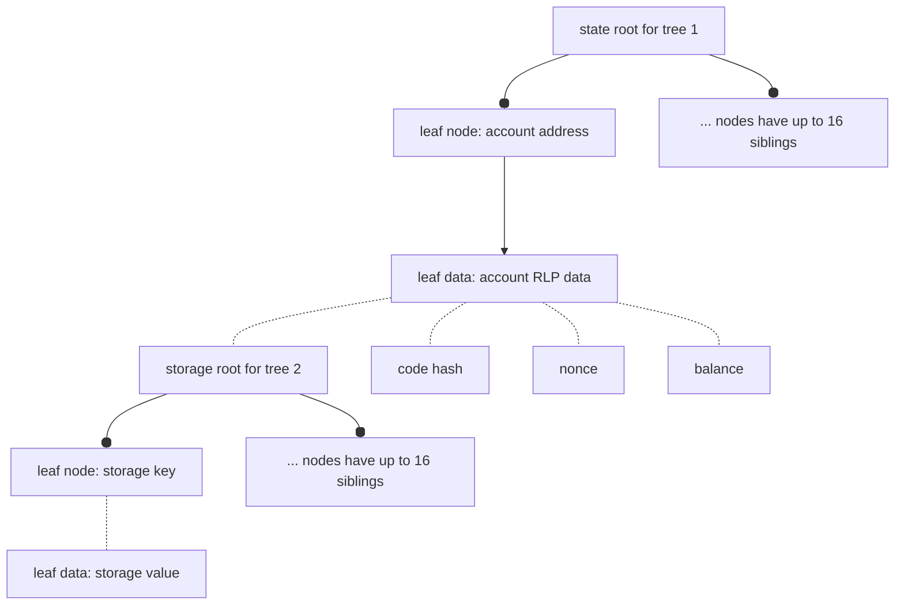
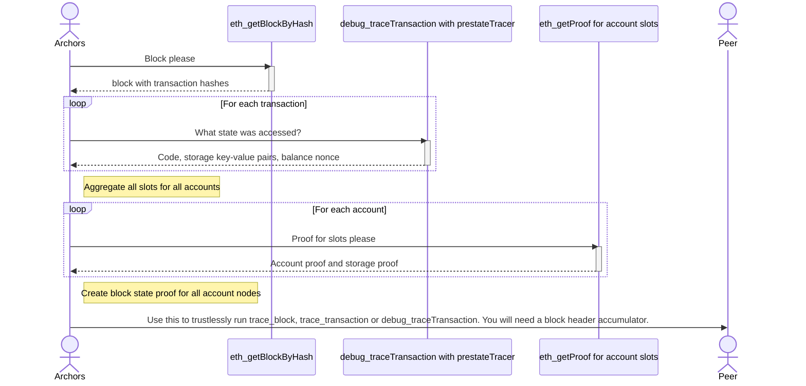

# archors

**arch**ival sciss**ors**: A tool for single Ethereum archival block state proofs.

## Why

To send a single historical block (as an historical state proof) to a peer and have
them be able to trustlessly trace the transactions in that block.

Background: https://perama-v.github.io/ethereum/protocol/archive

Who would want that? If there was a network distributing such proofs then users could
collectively shard an archive node. This could be an extension to an existing network
such as the Portal Network, which already has a block header cryptographic accumulator.

How are these >17 million proofs being generated? With this tool! One needs an archive node
that serves `eth_getProof`. Then the actual historical state at each block can be exported and stored. These proofs only include state that was accessed during that block, not the entire chain state.

A proof plus a block body allows isolated single block trace. That is, every EVM operation
can be replayed and inspected - without needing the rest of the chain. Nodes can store
subsets of the data and remain functional and trustless.

## Status

> 🚧 Toy/experimental

In order to construct proofs for the entire history of the chain an Ethereum execution
node must provide both:
- debug_traceTransaction
- eth_getProof

## Modes

|example number|crate used|function|
|-|-|-|
|1, 2, 3|inventory|obtain and cache block data from a node|
|4, 5|inventory|create merkle proof for block state|
|6|verify|verify merkle proof for block|
|7|tracer|locally produce `debug_traceTransaction` / `debug_traceBlock` using proof data|

## Use case

Run `debug_traceTransaction` or `trace_Transaction` with minimal data. A CDN could provide
proofs for all historical blocks. Acquisition of one is sufficient to trustlessly replay
that block and trace a single transaction.

## Requirements

- Requires knowledge of canonicality of block headers, such as through a cryptographic accumulator.
- Full node connection for blocks up to 128 blocks old, or archive node connection for older blocks.

## State proof viz

We are working with radix trees. The radix trees have depth 2, which makes them
a Practical Algorithm to Retrieve Information Coded in Alphanumeric (PATRICIA) trees.

The trees are nested, with one state tree (tree 1) holding the roots of many storage trees (tree 2).

### State tree value structure
The leaf data of the state root (first) tree is Recursive Length Prefix (RLP) encoded.
So to provide someone with a specific storage value (e.g., some storage slot that will be
accessed during a block) in the storage (second) tree, the RLP data must be reconstructed, hashed and proved in the first
tree. This requires that the code hash, nonce and balance for every account accessed must be
part of the proof data.

### Combining all accessed state

A retrospective look at one block can reveal all the leaf data that is needed to execute that block.
Aggregation of all those values into one big tree (tree 1 containing many values including
tree 2 roots) is the proof.

Imagine that a block only accessed one storage value from one contract (AKA account).
Here is the data that would be in the proof:
- Storage key
- Storage value
- Account storage root (of storage tree, using key/value)
- Account code hash
- Account nonce
- Account balance

A call to `debug_traceTransaction` with the `prestateTracer` may return
balance, code, nonce and storage, and some fields may absent.

If only the balance of an address is accessed (there is code etc that is not
accessed), the other fields are still required. Once obtained, the other fields are RLP encoded
to get the account leaf, then the hash of that encoded data is the account node.

Thus the prestateTracer is necessary (to know which storage keys are accessed) but
insufficient (does not get account storage root or other unaccessed account state fields).

The next step is therefore to call `eth_getProof` for every account. This will
provide the account node (account state root), the account value (RLP encoded data)
and the storage proof against the storage root in that encoded data.

The proof sent to a peer is a proof of all accessed accounts, and for each account
a proof for each accessed storage slot is included.

## State and proof data propoerties

A sample (`./data/blocks/17190873`) is prepared using the examples, which
call a node and cache the results for testing.

The cache has the following properties:
- 17KB block_with_transactions.json
    - TODO: Include transaction calldata by setting eth_getBlockByNumber flag to true.
- 13.1MB block_prestate_trace.json (don't need)
    - 4.4MB block_accessed_state_deduplicated.json
        - 1.6MB block_accessed_state_deduplicated.snappy
- 6.4MB block_state_proofs.json
    - 4.3MB block_state_proofs.json

Hence, in order to fully trace block `17190873` the data is:
- 17KB Transactions
- 1.6MB State
- 4.3MB Proofs

Total: ~6MB

There is still some duplication here, with some state values existing in the State
and Proof files. However, this will be a small value. Hence, the total size for the
data that needs to be sent to a peer for this particular block is approximately 6MB.

|Block|MGas|Txs|Internal Txs|State Values|State Proof|Total P2P payload|
|-|-|-|-|-|-|-|
|17190873|29|200|217|1.6 MB| 4.3 MB|5.9 MB|
|17193183|17|100|42|0.7 MB|2.6 MB|3.3 MB|
|17193270|23|395|97|1.4 MB|4.6 MB|5.9 MB|

This is too small a sample to extrapolate from, but I will do exactly that:
The total blockchain 1.7e7 * 5 MB = 8.5e7 MB = 8.5e4 GB = 8.5e1 TB = 85 TB.

With 100 nodes: 8.5 TB
|Nodes|Node size (replication=1)| Node size (replication = 10)|
|-|-|-|
|1|85TB|850TB|
|100|850GB|8.5TB|
|1000|85GB|850GB|
|10000|8.5GB|85GB|

### Additional compression

It is noted that contract data and merkle tree nodes are common amongst different blocks.
This represents compressible data for a single node. The prevalence of these occurrences
and therefore the amount of additional compression available is unknown.
