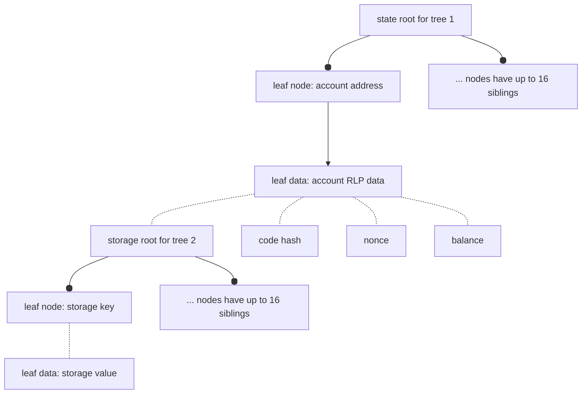
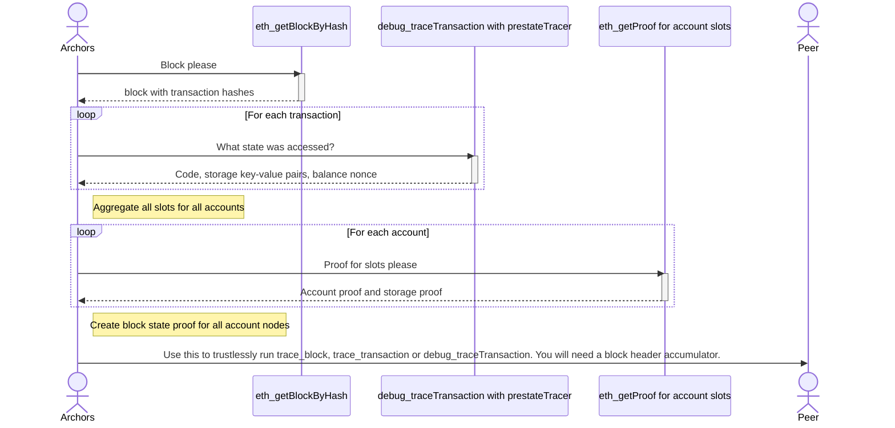

# archors

**arch**ival sciss**ors**: A tool for single Ethereum archival block state proofs.

## Why

To send a single historical block (as an historical state proof) to a peer and have
them be able to trustlessly trace the transactions in that block.

Background: https://perama-v.github.io/ethereum/protocol/archive

Who would want that? If there was a network distributing such proofs then users could
collectively shard an archive node. This could be an extension to an existing network
such as the Portal Network, which already has a block header cryptographic accumulator.

How are these >17 million proofs being generated? With this tool! One needs an archive node
that serves `eth_getProof`. Then the actual historical state at each block can be exported and stored. These proofs only include state that was accessed during that block, not the entire chain state.

A proof plus a block body allows isolated single block trace. That is, every EVM operation
can be replayed and inspected - without needing the rest of the chain. Nodes can store
subsets of the data and remain functional and trustless.

## Research questions

- Can you build a static data format for a sharded archive node?
    - Yes, composed of proofs specified with ssz types with deduplicated contract code and trie nodes.
- How much data needs to go over the wire to a peer who has a block with transactions,
but wants to now run `debug_TraceTransaction` without trusting some authority?
    - ~167 kb/Mgas
- How much data needs to be stored on disk for a node holding the proofs for a collection of
noncontiguous blocks (that they can send to peers):
    - ~155 kb/Mgas
- How big might an average sharded archive node need to be?
    - Maybe 100GB

## Status

> 🚧 Toy/experimental

In order to construct proofs for the entire history of the chain an Ethereum execution
node must provide both:
- debug_traceTransaction
- eth_getProof

## Modes

|example number|crate used|function|
|-|-|-|
|1, 2, 3|inventory|obtain and cache block data from a node|
|4, 5|inventory|create merkle proof for block state|
|6|inventory|measure data overlap between proofs for different blocks|
|7|inventory|collect stats on bytes/gas for proofs|
|8|verify|verify merkle proof for block|
|9|tracer|locally produce `debug_traceTransaction` / `debug_traceBlock` using proof data|
|10|inventory|obtain required state in one pass|

## Use case

Run `debug_traceTransaction` or `trace_Transaction` with minimal data. A CDN could provide
proofs for all historical blocks. Acquisition of one is sufficient to trustlessly replay
that block and trace a single transaction.

## Requirements

- Requires knowledge of canonicality of block headers, such as through a cryptographic accumulator.
- Full node connection for blocks up to 128 blocks old, or archive node connection for older blocks.

## State proof viz

We are working with radix trees. The radix trees have depth 2, which makes them
a Practical Algorithm to Retrieve Information Coded in Alphanumeric (PATRICIA) trees.

The trees are nested, with one state tree (tree 1) holding the roots of many storage trees (tree 2).



### State tree value structure
The leaf data of the state root (first) tree is Recursive Length Prefix (RLP) encoded.
So to provide someone with a specific storage value (e.g., some storage slot that will be
accessed during a block) in the storage (second) tree, the RLP data must be reconstructed, hashed and proved in the first
tree. This requires that the code hash, nonce and balance for every account accessed must be
part of the proof data.

### Combining all accessed state

A retrospective look at one block can reveal all the leaf data that is needed to execute that block.
Aggregation of all those values into one big tree (tree 1 containing many values including
tree 2 roots) is the proof.

Imagine that a block only accessed one storage value from one contract (AKA account).
Here is the data that would be in the proof:
- Storage key
- Storage value
- Account storage root (of storage tree, using key/value)
- Account code hash
- Account nonce
- Account balance

A call to `debug_traceTransaction` with the `prestateTracer` may return
balance, code, nonce and storage, and some fields may absent.

If only the balance of an address is accessed (there is code etc that is not
accessed), the other fields are still required. Once obtained, the other fields are RLP encoded
to get the account leaf, then the hash of that encoded data is the account node.

Thus the prestateTracer is necessary (to know which storage keys are accessed) but
insufficient (does not get account storage root or other unaccessed account state fields).

The next step is therefore to call `eth_getProof` for every account. This will
provide the account node (account state root), the account value (RLP encoded data)
and the storage proof against the storage root in that encoded data.


The proof sent to a peer is a proof of all accessed accounts, and for each account
a proof for each accessed storage slot is included.

## State and proof data properties

A sample (`./data/blocks/17190873`) is prepared using the examples, which
calls a node and caches the results. The data directory holds a lot of intermediate
data for testing.

The transferrable proof file (`./data/blocks/17190873/prior_block_transferrable_state_proofs.ssz_snappy`)
is the most important. It is an SSZ + snappy encoded representation of all the data required
to trace a block trustlessly. This includes contract code, account state values, storage state values and their respective merkle proofs.

Components required to trace the block:
- Block header confidence (header accumulator)
- `eth_getBlockByNumber` with flag transactions=`true`
- transferrable ssz snappy proof file.

Transferrable refers to this being a payload that could be transferred to a peer.

### Deduplication on the disk of a peer

Here are the properties of the blocks used in the examples directory.

|Block|MGas|Txs|Internal Txs|Total P2P payload|Payload per gas|
|-|-|-|-|-|-|
|17190873|29|200|217|3.3 MB|113 KB/Mgas
|17193183|17|100|42|1.6 MB|94 KB/Mgas
|17193270|23|395|97|3.8 MB|165 KB/Mgas

It is noted that contract data and merkle tree nodes are common amongst different blocks.
This represents compressible data for a single node.

Of the large data items (contract code, merkle trie nodes), the percentage saving for
different blocks can be calculated. As a node store more blocks, frequently encountered nodes
will become a larger share of the data. Hence, the marginal data to store goes down with
each new proof received.

|block proof received| proofs stored |percentage savings|
|-|-|-|
|17190873|1|0%|
|17193183|2|5%|
|17193270|3|10%|

Source: inter-proof-overlap example.

Here is a larger data set (data has not uploaded to the ./data directory):
- 20 blocks, 50 blocks apart.
- ssz proof stats: min 2.1MB, average 2.9MB, max 4.0MB, sum 57MB
- ssz_snappy Proof stats: min 1.7MB, max 3.5MB, average 2.3MB
- Total saved from repeated elements between blocks, attribution:
    - Contracts 12MB
    - Account nodes 0.8MB
    - Storage nodes 1.6MB
    - Savings = 14MB (26% of total for contracts/nodes)
- Marginal savings for additional blocks: see table below
- Total disk: 57MB - 14MB = 43MB
- Average disk size per proof after deduplication: ~= 2.1MB

|block number|block gas|block .ssz_snappy p2p wire|block wire per gas|block .ssz disk| block disk per gas|block count|cumulative sum duplicate discardable data|percentage disk saved
|-|-|-|-|-|-|-|-|-|
|17370025|13 Mgas|2269 kB|170 KB/Mgas|2918 KB|219 KB/Mgas|1|0 kB|0%|
|17370075|11 Mgas|1698 kB|143 KB/Mgas|2136 KB|180 KB/Mgas|2|337 kB|6%|
|17370125|16 Mgas|2418 kB|146 KB/Mgas|3086 KB|186 KB/Mgas|3|863 kB|10%|
|17370175|11 Mgas|2389 kB|208 KB/Mgas|2992 KB|261 KB/Mgas|4|1564 kB|14%|
|17370225|13 Mgas|2074 kB|154 KB/Mgas|2622 KB|195 KB/Mgas|5|2102 kB|15%|
|17370275|22 Mgas|2610 kB|115 KB/Mgas|3255 KB|143 KB/Mgas|6|2891 kB|16%|
|17370325|10 Mgas|1940 kB|190 KB/Mgas|2538 KB|248 KB/Mgas|7|3751 kB|19%|
|17370375|19 Mgas|2023 kB|103 KB/Mgas|2636 KB|135 KB/Mgas|8|4577 kB|20%|
|17370425|9 Mgas|1684 kB|181 KB/Mgas|2160 KB|232 KB/Mgas|9|5270 kB|21%|
|17370475|15 Mgas|3461 kB|221 KB/Mgas|4082 KB|261 KB/Mgas|10|6056 kB|21%|
|17370525|15 Mgas|2603 kB|169 KB/Mgas|3294 KB|214 KB/Mgas|11|7057 kB|22%|
|17370575|18 Mgas|2851 kB|151 KB/Mgas|3396 KB|180 KB/Mgas|12|7740 kB|22%|
|17370625|14 Mgas|2545 kB|180 KB/Mgas|3214 KB|227 KB/Mgas|13|8652 kB|22%|
|17370675|12 Mgas|2282 kB|181 KB/Mgas|2913 KB|231 KB/Mgas|14|9513 kB|23%|
|17370725|9 Mgas|1924 kB|197 KB/Mgas|2588 KB|266 KB/Mgas|15|10121 kB|23%|
|17370775|9 Mgas|1763 kB|178 KB/Mgas|2273 KB|229 KB/Mgas|16|10766 kB|23%|
|17370825|13 Mgas|2194 kB|168 KB/Mgas|2810 KB|215 KB/Mgas|17|11538 kB|23%|
|17370875|14 Mgas|2249 kB|154 KB/Mgas|2841 KB|195 KB/Mgas|18|12354 kB|23%|
|17370925|13 Mgas|2086 kB|158 KB/Mgas|2727 KB|207 KB/Mgas|19|13414 kB|24%|
|17370975|11 Mgas|2294 kB|191 KB/Mgas|2942 KB|245 KB/Mgas|20|14467 kB|25%|

Averages for a single block:
- disk: 155 KB/Mgas
    - This is with the duplicate contract code and account/storage nodes removed.
- wire: 167 KB/Mgas

Peers store blocks in a random distribution, so they will not be continuous. This decreases
the chance that there are similar trie nodes between the blocks. These blocks are 50 blocks
apart, which is to be expected for a node holding ~2% of network data.

### Lower state burden in history

Gas used for old blocks is lower. Let's estimate the total disk required to hold the proofs
for the whole chain, using the 155kb/Mgas (155MB/Bgas, 0.155Gb/Bgas, .155TB/Tgas) value from above. Daily gas estimates are made from eyeballing a daily gas used chart.

|year|average gas per day|gas for that year|disk for that year|
|-|-|-|-|
|2016|3 Bgas/day|1.1 Tgas|0.2 TB|
|2017|10 Bgas/day|3.7 Tgas|0.5 TB|
|2018|40 Bgas/day|15 Tgas|2.3 TB|
|2019|40 Bgas/day|15 Tgas|2.3 TB|
|2020|70 Bgas/day|26 Tgas|4.0 TB|
|2021|90 Bgas/day|33 Tgas|5.1 TB|
|2022|100 Bgas/day|37 Tgas|5.7 TB|
|2023|110 Bgas/day|40 Tgas|6.2 TB|

Total: 26 TB

### Node disk size

Let's say 30TB as a round estimate for the total proof size for mainnet (to block 17.3M).

A network hosting this data must replicate this data for resilience. So every block proof
must be present not 1, but 2, 3, ... 10? times. That replication factor is tunable and
so are the number of nodes in the network.

|Nodes|Node size (replication = 1)| Node size (replication = 2)| Node size (replication = 10)|
|-|-|-|-|
|1|30TB|60TB|300TB|
|100|300GB|600GB|3TB|
|1000|30GB|**-> 60GB <-**|300GB|
|10000|3GB|6GB|30GB|

The highlighted 60GB value indicates a network where:
- 1000 nodes exist
- Each proof is present present twice
- Nodes must therefore hold 60GB.

Which compared to other archive node setups:
- Less optimised: 10TB
- Optimised: 2TB (Erigon present)
- Theoretical target: 1TB (Erigon future)

Which is to say a user has access to a P2P node with `debug_traceTransaction` capabilities
at less than 10% of disk size of alternatives.

### Verkle transition

The size of the proof data will drop significantly if/when verkle tries are used.
However this will only apply to anterograde (post-verkle-fork) blocks.

## Trace data

What does tracing get you? Every step in the EVM.

```command
cargo run --release --example 07_use_proof |  grep '"REVERT"' | jq
```
This example is set to trace transaction index 14 in block 17190873. The
result is filtered to only include steps that involved a `REVERT` opcode.

Here we can see the `REVERT`s in action at stack depths 3, 2 and then 1 at
program counters 2080, 8672, 17898. One could create a parser that:

- The contract that was reverted from
- The function that was being called
- The values passed to that contract

```json
{
  "pc": 2080,
  "op": 253,
  "gas": "0x50044",
  "gasCost": "0x0",
  "memSize": 256,
  "stack": [
    "0xa9059cbb",
    "0x2f2",
    "0x53ae61d9e66d03d90a13bbb16b69187037c90f0d",
    "0x17d08f5af48b00",
    "0x0",
    "0x981",
    "0x9aaab62d0a33caacab26f213d1f41ec103c82407",
    "0x53ae61d9e66d03d90a13bbb16b69187037c90f0d",
    "0x17d08f5af48b00",
    "0x0",
    "0x64",
    "0x80"
  ],
  "depth": 3,
  "opName": "REVERT"
}
{
  "pc": 8672,
  "op": 253,
  "gas": "0x871d8",
  "gasCost": "0x0",
  "memSize": 576,
  "stack": [
    "0x22c0d9f",
    "0x257",
    "0x0",
    "0x17d08f5af48b00",
    "0x53ae61d9e66d03d90a13bbb16b69187037c90f0d",
    "0xa4",
    "0x0",
    "0x29f2360d4550f0ab",
    "0x10878fe6d250800",
    "0x0",
    "0x0",
    "0xc02aaa39b223fe8d0a0e5c4f27ead9083c756cc2",
    "0xfc720f8d776e87e9dfb0f59732de8b259875fa32",
    "0x8e1",
    "0xfc720f8d776e87e9dfb0f59732de8b259875fa32",
    "0x53ae61d9e66d03d90a13bbb16b69187037c90f0d",
    "0x17d08f5af48b00",
    "0x0",
    "0x124",
    "0x64",
    "0x1c4"
  ],
  "depth": 2,
  "opName": "REVERT"
}
{
  "pc": 17898,
  "op": 253,
  "gas": "0x895b0",
  "gasCost": "0x0",
  "memSize": 1184,
  "stack": [
    "0x7ff36ab5",
    "0x340",
    "0x71afd498d0000",
    "0xa4",
    "0x2",
    "0x53ae61d9e66d03d90a13bbb16b69187037c90f0d",
    "0x1787586c4fa8a01c71c7",
    "0xe0",
    "0x1787586c4fa8a01c71c7",
    "0x250b",
    "0xe0",
    "0x2ba",
    "0x53ae61d9e66d03d90a13bbb16b69187037c90f0d",
    "0x0",
    "0xc02aaa39b223fe8d0a0e5c4f27ead9083c756cc2",
    "0xfc720f8d776e87e9dfb0f59732de8b259875fa32",
    "0xc02aaa39b223fe8d0a0e5c4f27ead9083c756cc2",
    "0x17d08f5af48b00",
    "0x0",
    "0x17d08f5af48b00",
    "0x53ae61d9e66d03d90a13bbb16b69187037c90f0d",
    "0x9aaab62d0a33caacab26f213d1f41ec103c82407",
    "0x22c0d9f",
    "0x49b",
    "0x1",
    "0x64",
    "0x0"
  ],
  "depth": 1,
  "opName": "REVERT"
}
```


## BLOCKHASH opcode

The BLOCKHASH opcode is state that is not in the block but is accessible to the EVM.

Filtering for this opcode, we can see that it is used in transaction index 204 in block 17190873.
```jq
{
  "pc": 3398,
  "op": 64,
  "gas": "0x1ad74",
  "gasCost": "0x14",
  "memSize": 2304,
  "stack": [
    "0xd0f89344",
    "0x262",
    "0x5bf605d",
    "0x33",
    "0x7",
    "0x7f",
    "0x31",
    "0x54c16",
    "0x880",
    "0x2",
    "0x64544dd5",
    "0x1064fa6",
    "0xd5b",
    "0x1064fd8"
  ],
  "depth": 1,
  "opName": "BLOCKHASH"
}
```
Here we see BLOCKHASH pop the 0x1064fd8 (17190872) from top of the stack. The EVM expects
to be provided with the block hash of block 17190872, which is the block immediately prior
to the block being traced (17190873). That value is:
`0x573471736fea190c6fd49db2c40add79c9904ed92eea6b68f5f2490ff2ae7939`.


This value must be provided to the EVM. For example if using REVM then the environment
can store a map of blocknumber -> blockhash. So before starting the block trace, this
map can be populated by the block hashes that the EVM will need.

There are two approaches:
- Asynchronous tracing: When BLOCKHASH opcode is encountered, fetch it from the network. This
is not ideal because it can slow down tracing (e.g. 256 sequential network requests in the worst
case).
- Prepopulated, verifiable, data: Precompute what blockhashes are needed and include those with
the accessed state proofs for each block.

How do we know what will be required until the trace has completed? Well, essentially we can
foreshadow these accesses, just like we did for the state. Suppose only one block hash is
accessed. That can be provided in the data alonside the state proof, without including the other
255 block hashes that could have been read.

Threats to trustless tracing:
- A block hash for a different block is required: the EVM can throw an error "tried to read
blockhash, none found"
- A block hash is wrong: the portal node can audit all block hashes against its master accumulator
prior to tracing.
- Block hashes included that are not read: This can be audited by tracing the block, and if this
is skipped is capped at a bloat of 256 hashes.

### BLOCKHASH mapping construction

Start tracing a block - every time a BLOCKHASH opcode is encountered, record it. The
opcode may affect subsequent EVM operations, so it must be provided before proceeding.
Hence, while building this BLOCKHASH mapping the approach can be either:
- Trace using the local proof and asynchronous fetching blockhashes from a node as required.
- Trace using the same archive node used to construct the state proofs.
`eth_traceBlock | grep "BLOCKHASH" -A 1` will get the next EVM step, which now has the
block hash at the top of the stack. These can be parsed and stored.


Block traces can be filtered and the last element in the stack reveals the block
number and subsequent block hash.
```
curl -X POST -H "Content-Type: application/json" --data '{"jsonrpc": "2.0", "method": "debug_traceBlockByNumber", "params": ["17539445"], "id":1}' http://127.0.0.1:8545 \
    | grep -o '{[^}]*}' \
    | grep "BLOCKHASH" -A 1 \
    | grep -v '^--$' \
    | jq -r '(.stack | last)' \
    | awk '{getline second; print "{\"block_number\": \"" $0 "\", \"block_hash\": \"" second "\"}"}' \
    | jq -s '{"blockhash_accesses": .}' > blockhash_opcode_use.json
```
Resulting pairs of block number / block hashes:
```json
{
  "blockhash_accesses": [
    {
      "block_number": "0x10ba170",
      "block_hash": "0xc9abf101b4e600b1aa2952007e6532bb153462dd9ac8636f53c07afb2eaee78f"
    },
    {
      "block_number": "0x10ba16f",
      "block_hash": "0x1d67f61e2ab228e5e7bf28605a644490c54b33a20c434bdc1d334f4ef081c781"
    }
  ]
}
```

### BLOCKHASH mapping use

The block hash mapping can be bundled with the state proof for the block. That way, it may be
passed to a peer who can verify against the accumulator that the hashes are canonical
before tracing.

In `revm`, the in-memory db has a [blockhash map](https://github.com/bluealloy/revm/blob/main/crates/revm/src/db/in_memory_db.rs#L35) that we can set before using the EVM.

Using `executor.trace_transaction(204)?;` with block 17190873 in example 9, we can now see that
the BLOCKHASH opcode is used to access the blockhash from the prior block (17190872)

```command
cargo run --release --example 09_use_proof | grep "BLOCKHASH" -A 1 | jq
```
See that the EVM now has the correct hash `0x5734...7939` at the top of the stack after the
`DIFFICULTY` opcode was called.
```json
{
  "pc": 3398,
  "op": 64,
  "gas": "0x1ad74",
  "gasCost": "0x14",
  "memSize": 2304,
  "stack": [
    "0xd0f89344",
    "0x262",
    "0x5bf605d",
    "0x33",
    "0x7",
    "0x7f",
    "0x31",
    "0x54c16",
    "0x880",
    "0x2",
    "0x64544dd5",
    "0x1064fa6",
    "0xd5b",
    "0x1064fd8"
  ],
  "depth": 1,
  "opName": "BLOCKHASH"
}
{
  "pc": 3399,
  "op": 138,
  "gas": "0x1ad60",
  "gasCost": "0x3",
  "memSize": 2304,
  "stack": [
    "0xd0f89344",
    "0x262",
    "0x5bf605d",
    "0x33",
    "0x7",
    "0x7f",
    "0x31",
    "0x54c16",
    "0x880",
    "0x2",
    "0x64544dd5",
    "0x1064fa6",
    "0xd5b",
    "0x573471736fea190c6fd49db2c40add79c9904ed92eea6b68f5f2490ff2ae7939"
  ],
  "depth": 1,
  "opName": "DUP11"
}
```

### Data expansion

Local tracing has better trust assumptions, but is also more efficient compared to receiving a trace from a third-party.

Traces are detailed expansions of the EVM, and are more suited to perform locally rather than
request.

For example, block `17640079` trace can be generated from the following ~3MB data:
- 277KB Block with transactions (`block_with_transactions.json`)
- 1.9MB State with proofs (`prior_block_transferrable_state_proofs.ssz_snappy`)

The trace generated is:
- Memory disabled: 270MB (100x bandwidth vs local)
- Memory enabled: 35GB (10_000x bandwidth vs local)

### Future considerations - Beacon root

Like BLOCKHASH, `EIP-4788: Beacon block root in the EVM` is an opcode that allows
the EVM to read state that is presumed available to the executor. The opcode will
allow the EVM to access up to 8192 of the prior beacon block state roots.

If this EIP is included, this data should be included alongside BLOCKHASH data. That is,
trace the block, search for the opcode and add beacon roots to the bundle that is passed
to a peer. They can verify the canonicality of those roots prior to EVM execution.

### Future considerations - BLOBHASH

The BLOBHASH opcode is introduced by `EIP-4844: Shard blob transactions` and allows
the EVM to read state that is already present within the block body. Each block may contain
some number of blob-type transactions (max ~6).

Each blob transaction may contain multiple blob hashes (limited by max for block). The EVM may access those hashes by using the index of the blob within that transaction. Blobs from other transactions are not accessible by the EVM.

No blob hashes from prior blocks are accessible by the EVM.
Hence, the state required to trace the block does not change.
