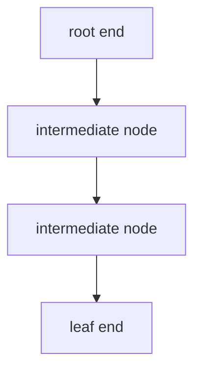
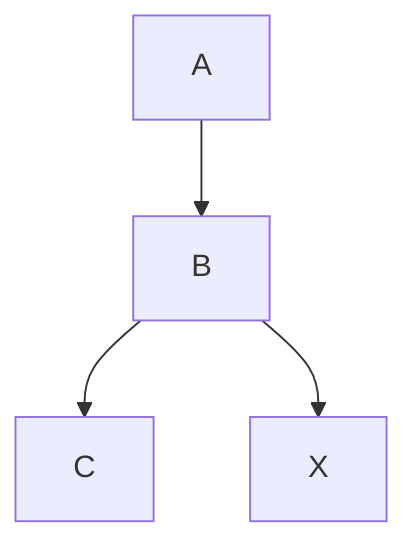
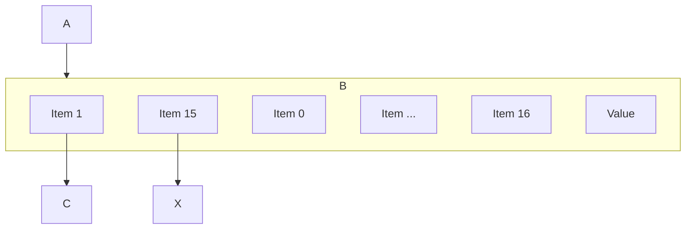
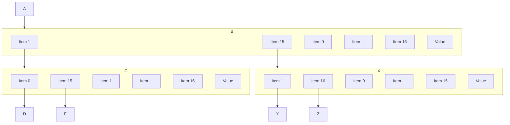
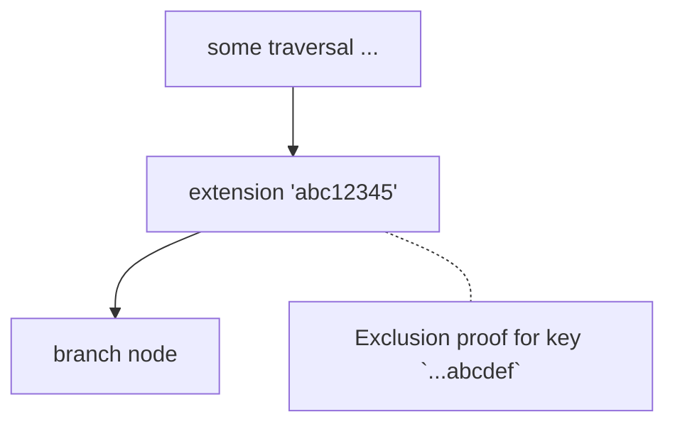
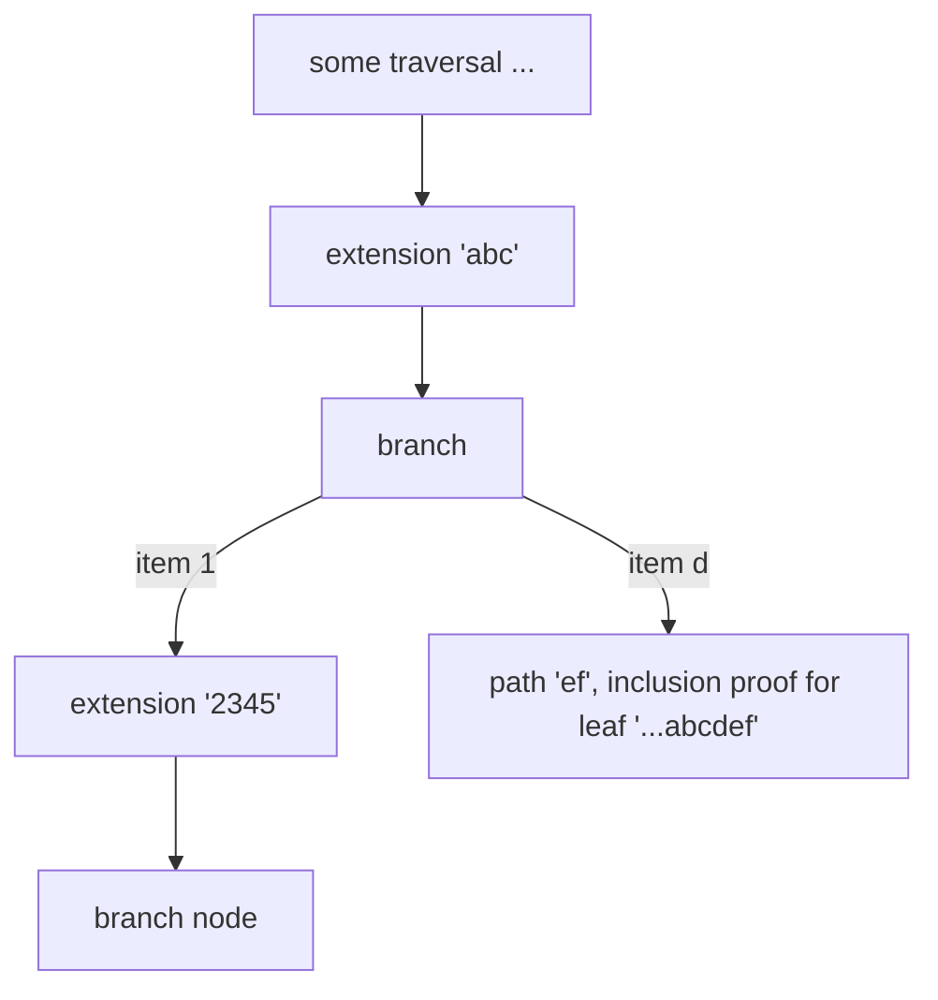

# archors-multiproof

Combine multple EIP-1186 proofs rooted in the same block.

This allows the state root to be updated using state changes that occur
due to transactions in that block.

## Why

If one has a collection of proofs that cover all state for a block, then updating
this collection to get post-transaction state roots requires aggregating this collection
into a multiproof.

After applying every transaction in a block, the state root will be equal to the
state root in the header for that block.

This verifies that execution of transactions resulted in the correct state changes
for the block.

One cannot use a proof library that takes leaves as inputs because we do not know
all the leaves in the tree - we only have values along the path for key being proven.

## How

1. Get proofs (see archors-inventory)
2. Verify the proof data (see archors-verify) against the block state root of the previous header.
3. Start executing transactions (see archors-tracer) and observe state changes after each transaction.
4. Combine storage proofs / account proofs that belong to the same tries, then make changes to leaves (this crate).

Trie proofs visually look like pruned trees. Overlapping multiple pruned versions of the same tree
results in some common path/nodes. Now when one leaf is modified it will change nodes present
in the path for a different key. These changed nodes makes the proof for that key valid with
respect to the new updated root.

The input is a list of proofs (either multiple accounts or multiple storage slots for one account).
The output is a struct that has overlapped the proofs into one structure (multiproof).

Then calling update will compute the new hashes from leaf -> root and produce a new root hash.

## Architecture

### Combining proofs
An EIP-1186 proof consists of a vector of nodes, starting with the root end:

Where each node consists of items:
- Branch node (16 node hashes, +/- 1 value)
- Extension node (extension, next node hash)
- Leaf node (path, value)

Suppose we have two accounts, with proofs: [A, B, C] and [A, B, X]

Node B, which is commone to both proofs is a branch node. As the proofs
diverge here, the path followed for the different accounts diverges here,
and different items in this node are followed:

Here to get to node X, item index 15 was followed.

To combine these proofs, we see that node B is unchanged, we refer to different items within it.
However, if there are nodes at the level below, we can see that we may now need to store multiple nodes at a given level/depth in the tree.

With branches, extension nodes and exclusion proofs the shape of the trie can vary a lot.

### Retrieval

An element in the proof will be looked up by key, which defines the path (nibbles along `keccak(key)`) to follow from root to hash.

Suppose one wants to look up E, but there has been an update where D was changed and now A, B and C are all different.

1. Get the path (keccak(E))
2. Start at the root of the tree and follow the first nibble/path part
3. Item 1 is reached, which is a hash.
4. Look up the hash in a hashmap, C is returned.
5. Continue nibble/path part. Get the hash, look it up to get E.

What was the process for updating D?

1. Retrieve D (see above), but retain the parts along the way.
2. Modify D, then hash it
3. Recall the prior node. Now modify item 0 to be keccak(D).
4. Continue to the prior node, replace the item with the hash of the modified child.

Hence we have a hashmap that we are modifying the values of.

### Summary
For a set of proofs with a known root, pile the proof nodes all into a HashMap keccak(node), node. Then pile all the keys into a vector.

The proof is capped in size (it's for one block) and will fit in memory, so
no optimisations seem important here (proof sparsity, HashMap replacements, Etc.,).

Make a modification (see above). Then when recalculate the hashes all the way to the root. This is the new root of the trie. This must be stored so one can retrieve the root for following paths for
any key.

### Editing proofs

A change the the proof structure may be required to get the post-block state root.
For example: If a key is not in the trie, and is added during the block, then it
may start as an exclusion proof, and will then be an inclusion proof.

Exclusion proof for path ...abcdef

Converting to inclusion proof, the extension node is shortened to 'abc' and a new branch
node is added:

