# archors-multiproof

Combine multple EIP-1186 proofs rooted in the same block.

This allows the state root to be updated using state changes that occur
due to transactions in that block.

> 🚧 Blocker: For some key deletions, there is insufficient data to construct
the new root.

## Why

If one has a collection of proofs that cover all state for a block, then updating
this collection to get post-transaction state roots requires aggregating this collection
into a multiproof.

After applying every transaction in a block, the state root will be equal to the
state root in the header for that block.

This verifies that execution of transactions resulted in the correct state changes
for the block.

One cannot use a proof library that takes leaves as inputs because we do not know
all the leaves in the tree - we only have values along the path for key being proven.

## How

1. Get proofs (see archors-inventory)
2. Verify the proof data (see archors-verify) against the block state root of the previous header.
3. Start executing transactions (see archors-tracer) and observe state changes after each transaction.
4. Combine storage proofs / account proofs that belong to the same tries, then make changes to leaves (this crate).

Trie proofs visually look like pruned trees. Overlapping multiple pruned versions of the same tree
results in some common path/nodes. Now when one leaf is modified it will change nodes present
in the path for a different key. These changed nodes makes the proof for that key valid with
respect to the new updated root.

The input is a list of proofs (either multiple accounts or multiple storage slots for one account).
The output is a struct that has overlapped the proofs into one structure (multiproof).

Then calling update will compute the new hashes from leaf -> root and produce a new root hash.

## Architecture

### Combining proofs
An EIP-1186 proof consists of a vector of nodes, starting with the root end:

Where each node consists of items:
- Branch node (16 node hashes, +/- 1 value)
- Extension node (extension, next node hash)
- Leaf node (path, value)

Suppose we have two accounts, with proofs: [A, B, C] and [A, B, X]

Node B, which is commone to both proofs is a branch node. As the proofs
diverge here, the path followed for the different accounts diverges here,
and different items in this node are followed:

Here to get to node X, item index 15 was followed.

To combine these proofs, we see that node B is unchanged, we refer to different items within it.
However, if there are nodes at the level below, we can see that we may now need to store multiple nodes at a given level/depth in the tree.

With branches, extension nodes and exclusion proofs the shape of the trie can vary a lot.

### Retrieval

An element in the proof will be looked up by key, which defines the path (nibbles along `keccak(key)`) to follow from root to hash.

Suppose one wants to look up E, but there has been an update where D was changed and now A, B and C are all different.

1. Get the path (keccak(E))
2. Start at the root of the tree and follow the first nibble/path part
3. Item 1 is reached, which is a hash.
4. Look up the hash in a hashmap, C is returned.
5. Continue nibble/path part. Get the hash, look it up to get E.

What was the process for updating D?

1. Retrieve D (see above), but retain the parts along the way.
2. Modify D, then hash it
3. Recall the prior node. Now modify item 0 to be keccak(D).
4. Continue to the prior node, replace the item with the hash of the modified child.

Hence we have a hashmap that we are modifying the values of.

### Summary
For a set of proofs with a known root, pile the proof nodes all into a HashMap keccak(node), node. Then pile all the keys into a vector.

The proof is capped in size (it's for one block) and will fit in memory, so
no optimisations seem important here (proof sparsity, HashMap replacements, Etc.,).

Make a modification (see above). Then when recalculate the hashes all the way to the root. This is the new root of the trie. This must be stored so one can retrieve the root for following paths for
any key.

## Editing proofs

A change the the proof structure may be required to get the post-block state root.
For example: If a key is not in the trie, and is added during the block, then it
may start as an exclusion proof, and will then be an inclusion proof.

Exclusion proof for path ...abcdef

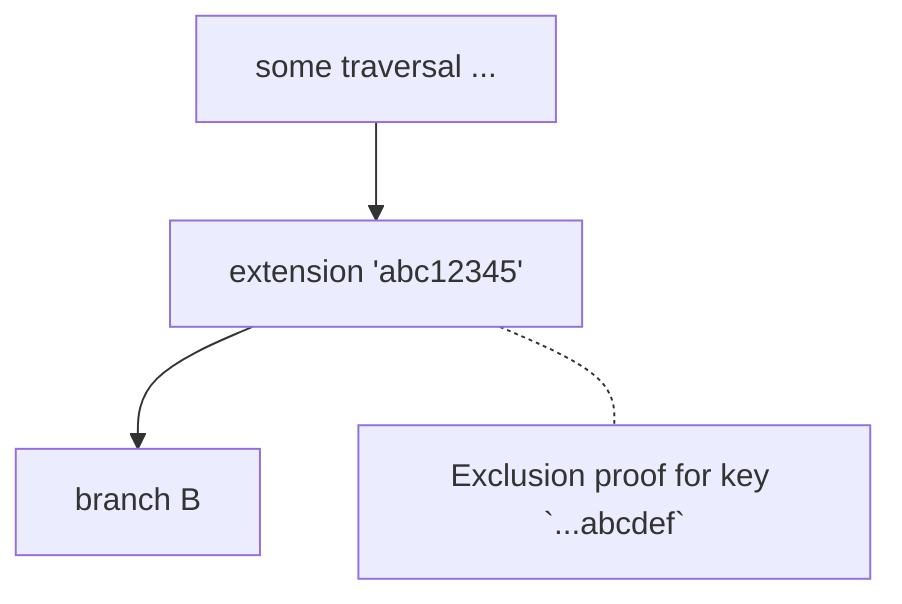

Converting to inclusion proof, the extension node is shortened to 'abc' and a new branch
node is added:

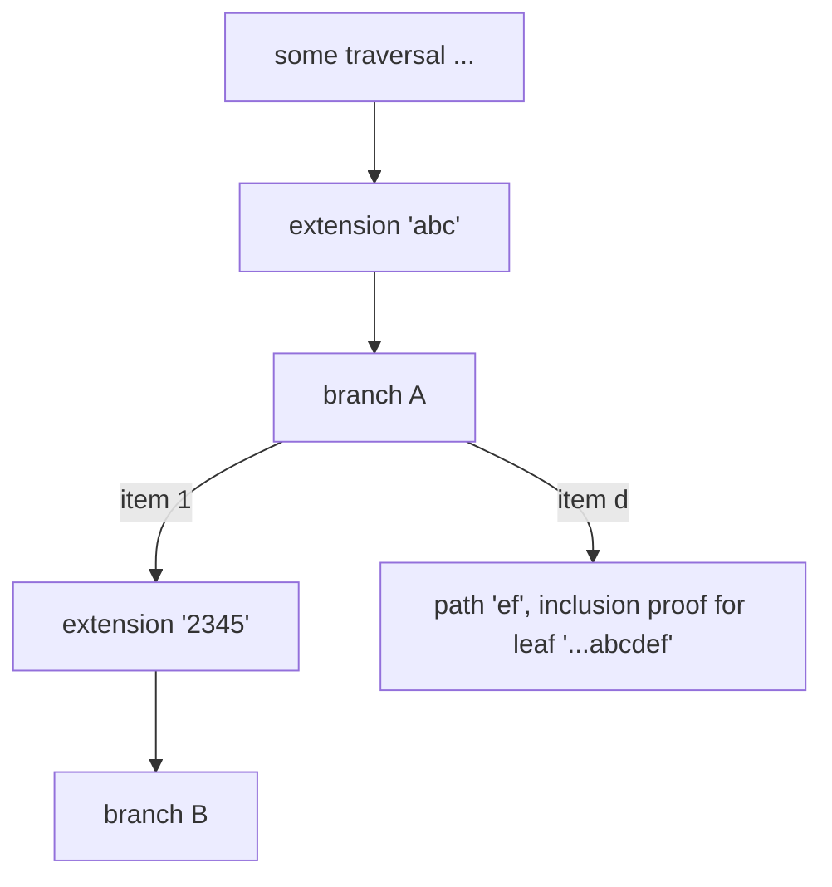

## Proof edits with tree depth reduction: sibling fetching

If there is an inclusion proof that is converted to an exclusion proof, this
may result in a removal of some internal nodes.

In some cases, this requires knowledge of nodes where only the hash(node) is present.
These cases have the property:
- The leaf has only one sibling node
- The sibling node is an extension or a leaf

In a trio (grandparent-parent-sibling):
- **E & **L: Additional sibling node RLP required to make updates.
    - EBE -> E
    - EBL -> L
    - BBE -> BE
    - BBL -> BL
- **B: Additional sibling node RLP required only to differentiate from above cases.
    - EBB -> EB
    - BBB -> BEB

### Pattern: Extension-Branch-Extension to Extension

Suppose the deletion of key ...abcdef

In this case, branch A is removed and the surrounding two extensions are be combined.

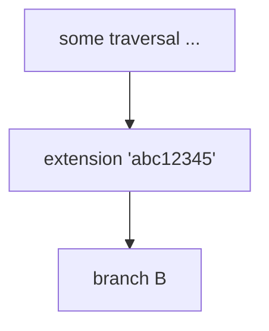

Pattern: EBE -> E+

This creates a problem because we do not have the extension node '2345' in this multiproof,
only the hash of that node inside branch B. The extension node is not available, and
so it is not known what path to combine with the 'abc1' path.

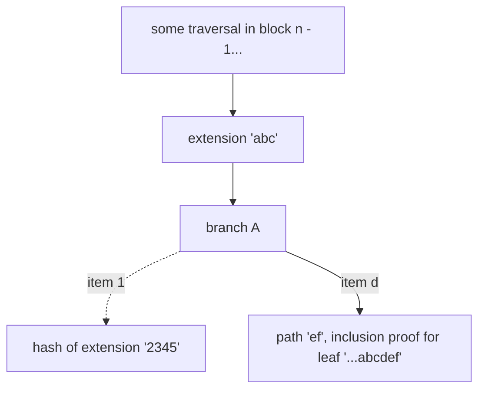
Resolution: This scenario can be anticipated and the node can be made part of the
data required for block `n`. Here the absence of the key in the next block is
identified and an exclusion proof obtained via `eth_getProof`. Let's call this
method "sibling fetching"

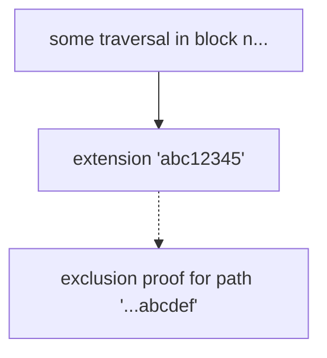

### Pattern: Branch-Branch-Extension to Branch-Extension

This is a different trie structure that results in the same situation.
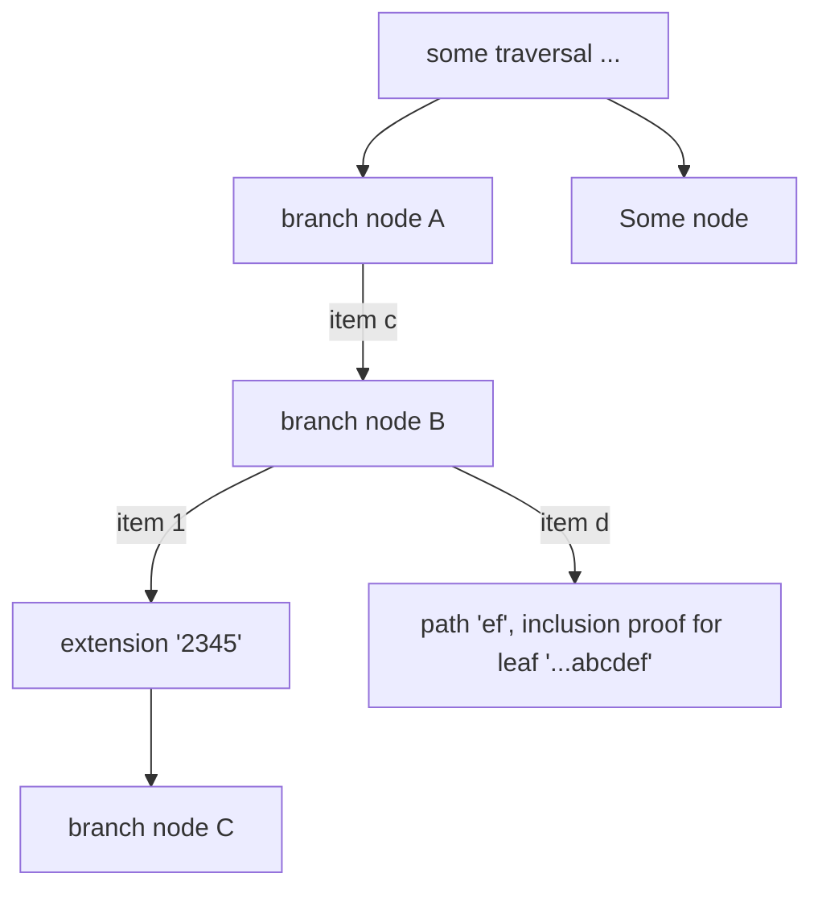

In this case, branch node B will only have one item and must be removed.
The extension now absorbs the extra '1' part of the path. As above, this
requires sibling fetching.

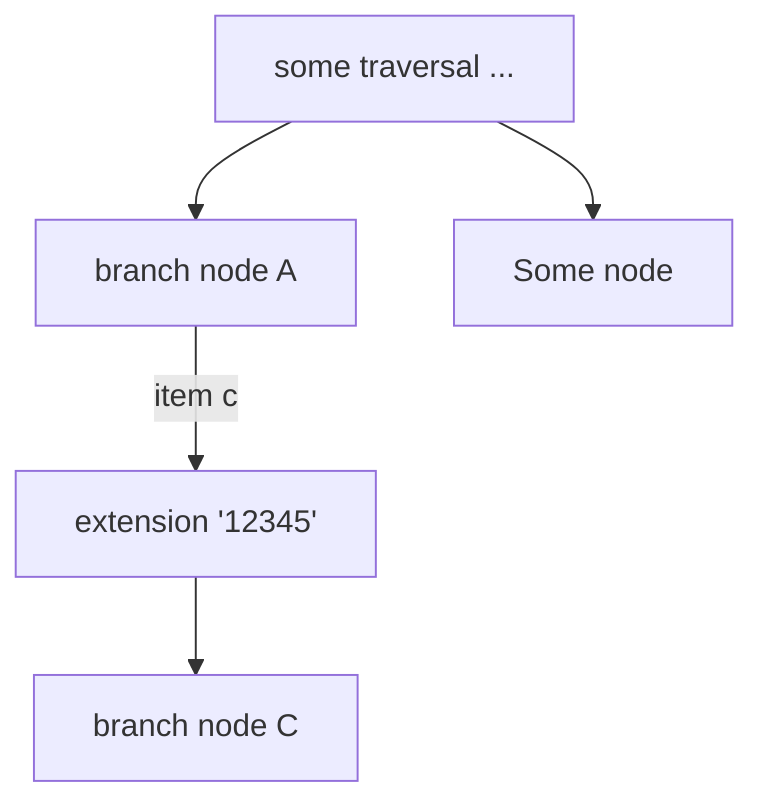

Pattern: BBE -> BE+

### Pattern: Extension-Branch-Branch to Extension-Branch

This is a a trie structure where the sibling is a branch. This does not require special additional knowledge.

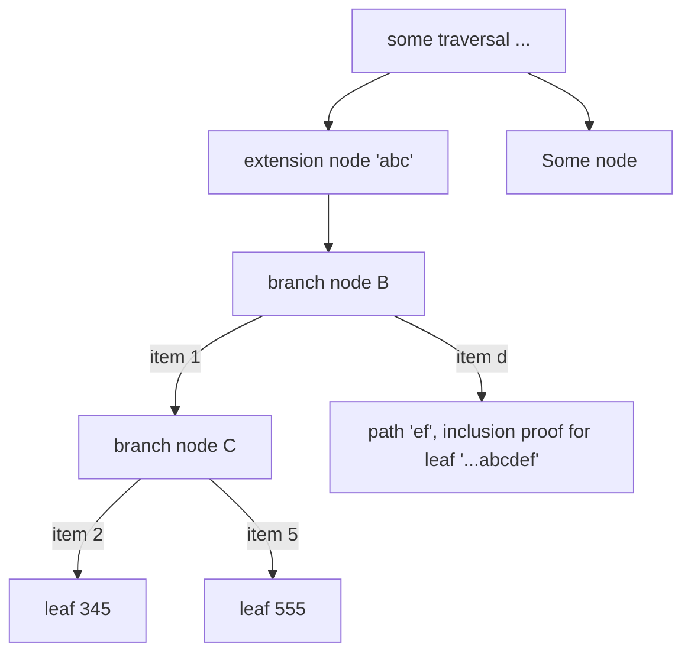

The Branch node B is removed, so the extension gains the '1'

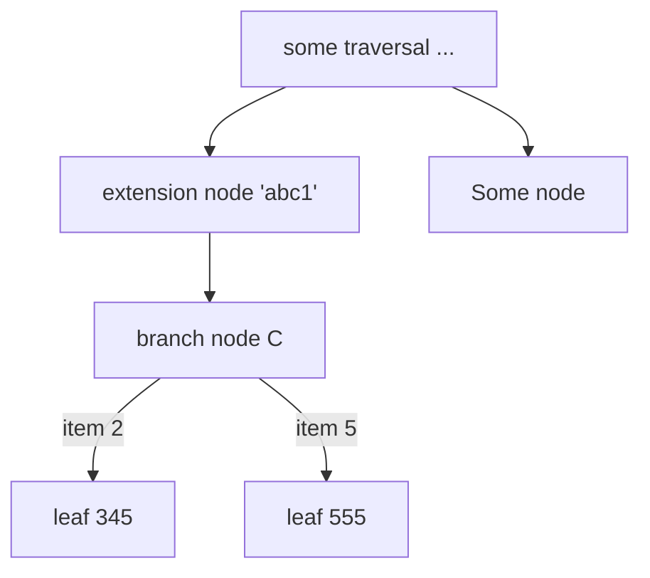

Pattern EBB -> E+B

### Pattern: Branch-Branch-Branch

This is a trie structure where the sibling is a branch and so is the grandparent.
This does not require special additional knowledge.

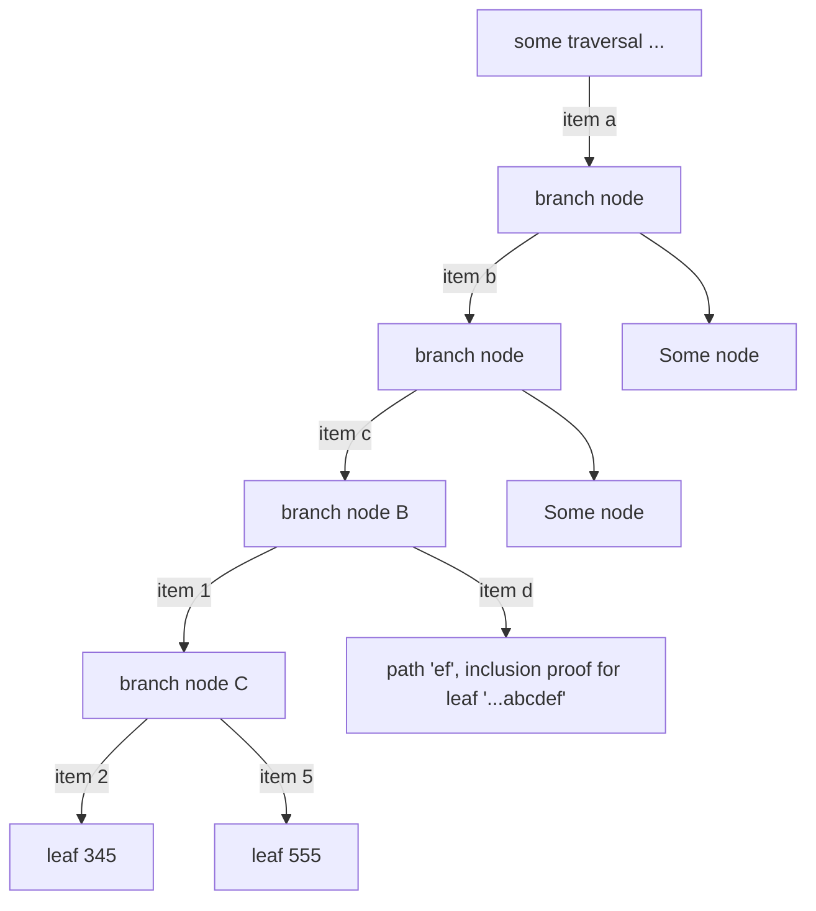

The Branch node B is removed, and itself has a siblings, so it is turned into a single
nibble extension '1'.

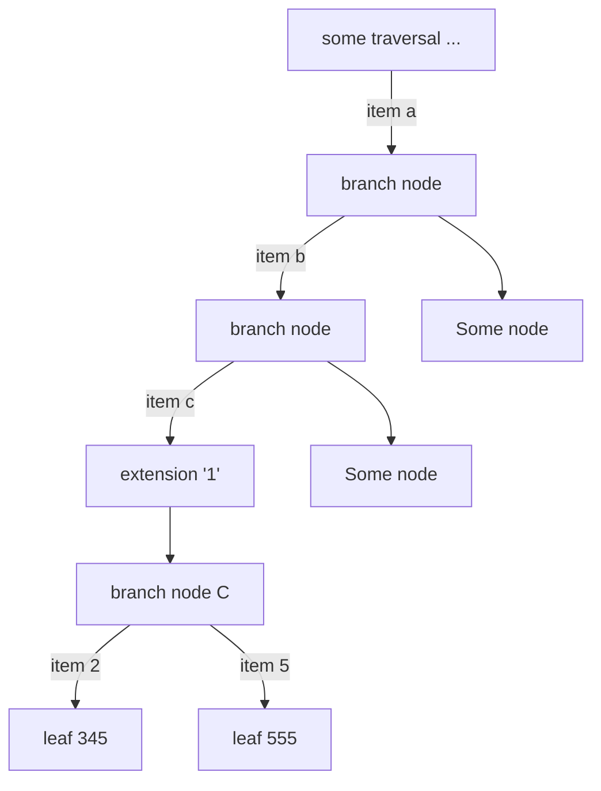

Pattern BBB -> BEB

### Live updates

When executing a block and updating the multiproof in real time, the requirement for
"sibling fetching" creates an additional constraint.

- Without sibling fetching
    - Traverse path (root -> leaf), get value, update value
    - Backtrack path and update trie.
- With sibling fetching
    - Traverse path (root -> leaf), get value, update value
    - Backtrack path and if additional data is required, look in "fetched extensions" (block `n`)
    for the node. That is, using the node hash, retrieve the node. The node may be:
        - Present: Proceed in updating the trie (removing nodes etc.) back to the root.
        - Absent: This means that there is some update to that part of the trie
        that has not yet been applied. Remove the leaf being deleted but leave the branch
        with a single child. It will later be traversed along that child at which point
        the branch can be deleted and the extensions updated appropriately. This can be called
        a single-child  branch

The explanation for leaving a single-child branch is as follows.
Consider that the fetched extension '2345' is based on the state root for block `n`,
after the application of all the transactions (say 100 transactions).

If we are at transaction 50 and are trying to remove the leaf from the multiproof,
but at transaction 75 there is an update to branch B. This means that when
looking up the extension hash during transaction 50, the hash will not be present in
the fetched extensions data. Only after 75 will the hash be guaranteed to
correspond to a node in the trie for block `n`.

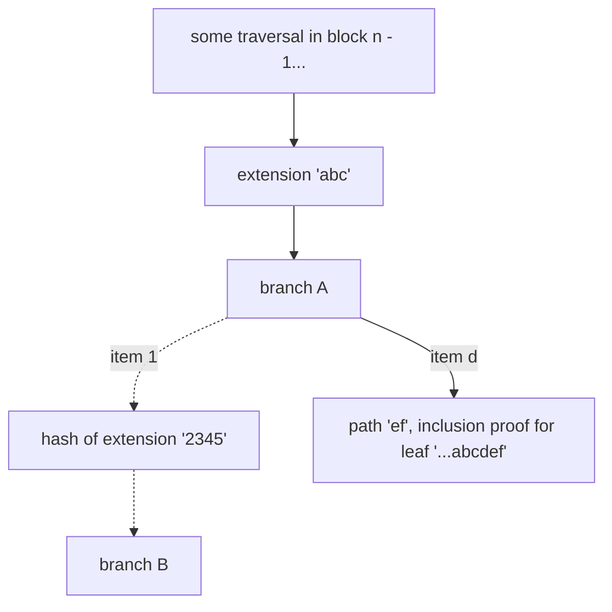

So, branch A is not able to be updated until after lower levels have been updated
in later transactions. So, the node is modified to only have one child to serve as a flag
that it is awaiting later transaction state changes.

Suppose the very next state lookup is for some key after branch B. The outdated traversal can
still be used (we only removed the leaf and so the branch is still present). The value is updated
and then on backtrack, if a branch with one child is found, it should be removed.

This means that while the state root between transactions 50 and 75 will be incorrect, after
that point it will be correct again. The root at after the last transaction should match
the root in the block header.

### Enumeration of scenarios

- Grandparent
    - Parent (branch, for deletion)
        - Remaining single sibling (at some index in parent)

Considering what to do when parent is branch (for deletion) and there is only one sibling:

- Sibling leaf
    - Grandparent Branch: Add sibling branch index to sibling leaf path. Requires knowledge of sibling node.
        - get_proof in subsequent block for the removed key: this will get an exclusion proof up to the grandparent branch which is not enough to fetch the leaf node.
    - Grandparent Extension: Remove grandparent extension, add sibling branch index and grandparent extension path to sibling leaf path. Requires knowledge of sibling node.
- Sibling extension
    - Grandparent Branch: Add sibling branch index to sibling extension. Requires knowledge of sibling node.
    - Grandparent Extension: Remove grandparent extension. Add sibling branch index and grandparent extension to sibling extension. Requires knowledge of sibling node.
- Sibling branch
    - Grandparent Branch: Add an extension above the sibling. Make the sibling branch index the extension path.
    - Grandparent Extension: Add sibling branch index to grandparent extension.

Rule: if the sibling is an extension or leaf, the sibling node is required ("sibling fetching")

